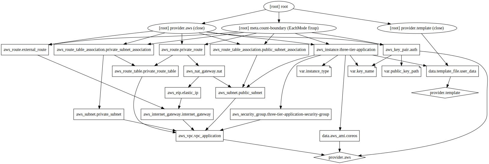
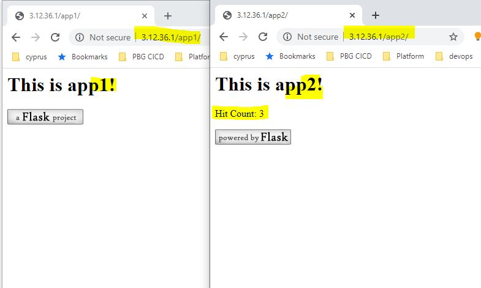
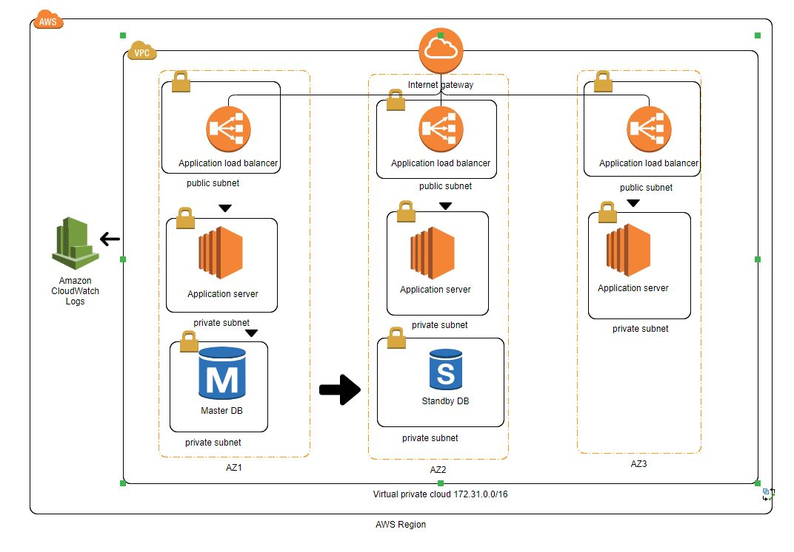

# three-tier-app-aws-terraform
Simple three-tier app example deployed to AWS using Terraform.

# three tier application definition 
```
A “tier” in this case can also be referred to as a “layer”. The three tiers, or layers, involved include:
-  A `Presentation Layer` that sends content to browsers in the form of HTML/JS/CSS. This might leverage frameworks like React, Angular, Ember, Aurora, etc.
-  An `Application Layer` that uses an application server and processes the business logic for the application. This might be written in C#, Java, C++, Python, Ruby, etc.
-  A `Data Layer` which is a database management system that provides access to application data. This could be MSSQL, MySQL, Oracle, or PostgreSQL, Mongo, etc.
```  

# Requirements
- Terraform >= `v0.12.20`
- `AWS_ACCESS_KEY_ID` and `AWS_SECRET_ACCESS_KEY` environment variables exported.

# Usage
Clone this repository and run:

Initializing Terrraform remote backend:
```
<path-to>/challenge1-tier-app-aws-terraform  terraform init -backend-config=terraform.remote
```

Terraform plan:
```
<path-to>/challenge1-tier-app-aws-terraform  terraform plan
```

Terraform apply:
```
<path-to>/challenge1-tier-app-aws-terraformterraform apply
```

# Terraform graph 



# Application output 

After the process is completed, should then be able to connect to (web layer) `http://ELB_IP/app1` 
and `http://ELB_IP/app2` (application later connecting to DB later to fetch no of hits)in your browser.




# Aws architecture used.




# References
- https://github.com/lbracken/docker-example (for the example three-tier application)
- https://www.terraform.io/docs/index.html
- https://nickcharlton.net/posts/terraform-aws-vpc.html (provided me a quick overview of resources to be created after the VPC, like proper route association)
